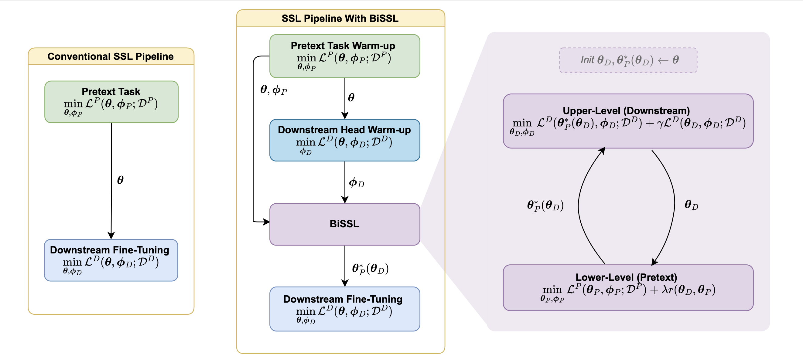

# BiSSL: Bilevel Optimization for Self-Supervised Pre-Training and Fine-Tuning
This repository holds the pytorch-implementation accompanying the paper on BiSSL (submitted to ICLR 2025). The implementation is verified to work for single-node multi-gpu (cuda) setups.


## Pre-Trained Model Weights and Datasets
Per default, all model weights shall be stored in the *models* folder. Pre-trained models used for the experiments in the paper are available for download [here](https://drive.google.com/drive/folders/1thTprOQpCYN1sh2AAHqhYaOo6Vz7-u96?usp=share_link).

Datasets are per default stored in the *data* folder. The training/validation partitions made in connection with the paper are found in the *data/tv_splits* folder, each file containing the indexes of its respective partition.

## Overview of main training scripts:
The script *config_default.py* contains an overview of all adjustable hyperparameters which can be parsed as arguments when executing the code from a terminal. The defaults are chosen corresponding to the hyper-parameters specified in the paper.

#### Self-Supervised Pre-Training (*ssl_pre-training.py*)
To conduct conventional self-supervised pre-training (using SimCLR) with 4 GPUs and the same hyperparamters as specified for the baseline setup in the paper, run the following:
```
torchrun --nproc-per-node 4 ssl_pre-training.py
```
To train the model used prior to conducting BiSSL in the experiments of the paper, alter the line to
```
torchrun --nproc-per-node 4 ssl_pre-training.py --epochs 500
```
See *config_default.py* for additional arguments to parse.

#### BiSSL (*bissl.py*)
To conduct the linear downstream head warmup followed by BiSSL on the flowers dataset, using the self-supervised pre-trained model parameters as specified in the paper (i.e. achieved by running the line above), run:
```
torchrun --nproc-per-node 4 bissl.py --d-dset 'flowers' --p-pretrained-backbone-filename 'pretext_arch-resnet18_epochs600_bb.pth' --p-pretrained-proj-filename 'pretext_arch-resnet18_epochs600_proj.pth'
```
See *config_default.py* for additional arguments to parse.

#### Fine-Tuning (*fine-tuning.py*)
To conduct hyper-parameter optimization by conducting a random grid search over 200 combinations of learning rates and weight decyas (as specified in the paper) used for fine-tuning a self-supervised pre-trained backbone (i.e. as obtained from running *ssl_pre-training.py*) on the flowers dataset, run the following line
```
torchrun --nproc-per-node 4 fine-tuning.py --dset 'flowers' --pretrained-backbone-filename 'pretext_arch-resnet18_epochs600_bb.pth' --backbone-origin 'pretext' --num-runs 200 --use-hpo 1
```

To conduct a similar run, but with a backbone obtained using BiSSL instead, run the following:
Post BiSSL
```
torchrun --nproc-per-node 4 fine-tuning.py --dset 'flowers' --pretrained-backbone-filename 'BiSSL-backbone_arch-resnet18_dset-flowers.pth' --backbone-origin 'bissl' --num-runs 200 --use-hpo 1
```

Lastly, run the following to conduct 10 fine-tunings on the flowers dataset, all using the same specified learning rates and weight decays, but with different random seeds:
```
torchrun --nproc-per-node 4 fine-tuning.py --dset 'flowers' --pretrained-backbone-filename 'BiSSL-backbone_arch-resnet18_dset-flowers.pth' --backbone-origin 'bissl' --num-runs 10 --use-hpo 0
```

See *config_default.py* for additional arguments to parse.
